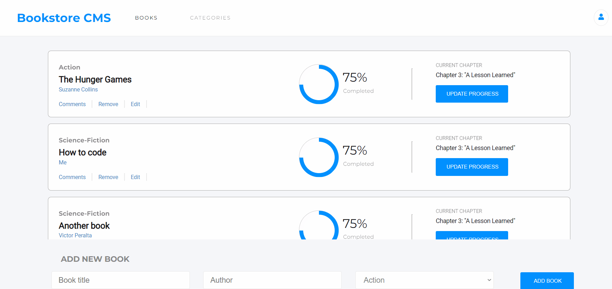

# Bookstore 
> A Bookstore App created using React

## Built With

- HTML
- CSS
- Javascript
- React

## Live Demo
[Bookstore](https://vicperalta.github.io/react-bookstore/)   

### Desktop version

## Getting Started

To get a local copy follow these simple example steps.  

1.- Open the terminal window and clone the repository using this command:  
`git clone git@github.com:VicPeralta/react-bookstore.git` 

2.- Change the directory to the react-bookstore directory  
`cd react-bookstore`  
3.- Install the project's dependencies by running this command:   
`npm install`  
4.- Generate the dist folder using this command:  
`npm run build`  
5.- Run this command to see the page `npm start`  
6.- To see the code open the project in the code editor of your preference.  

## Author

👤 **Victor Peralta**
- GitHub: [@VicPeralta](https://github.com/VicPeralta)
- Twitter: [@VicPeralta](https://twitter.com/VicPeralta)
- Linkedin: [@VicPeralta](https://www.linkedin.com/in/victor-peralta-gomez-648072107/)

## 🤝 Contributing

Contributions, issues, and feature requests are welcome!

Feel free to check the [issues page](https://github.com/VicPeralta/react-bookstore/issues).

## Show your support

Give a ⭐️ if you like this project!

## Acknowledgments

- A special thank for @fernandorpm for this amazing [README template](https://github.com/microverseinc/readme-template)

## 📝 License

This project is [MIT](./LICENSE.md) licensed.

